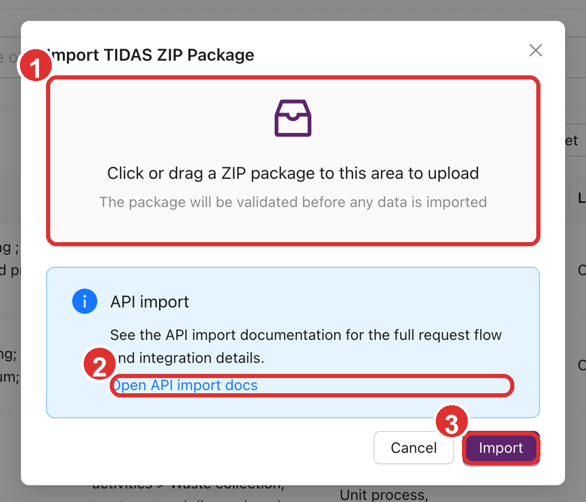
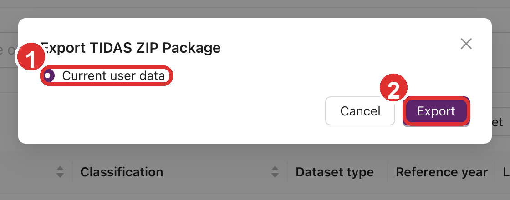

# TIDAS ZIP 导入、导出与任务中心

平台当前提供了面向终端用户的 TIDAS ZIP 数据包工作流。相关入口都位于顶部全局工具条，而不
是在某一个数据列表页内部。

如果您只需要接口方式，请阅读 [TIDAS 数据包导入 API](/docs/openapi/tidas-package-import)。
本文主要说明网页端的交互流程。

## 入口位置

顶部工具条中与数据包相关的三个入口分别是：

- **导入 TIDAS ZIP 数据包**
- **导出 TIDAS ZIP 数据包**
- **任务中心**

建议先了解 [按键功能介绍](./key-functions-introduction) 中的顶部控件地图，再回来执行具体操作。

## 导入 TIDAS ZIP 数据包

### 适用场景

- 将外部整理好的 TIDAS 数据包整体导入当前系统
- 批量迁移流程、模型、流及其依赖对象
- 对接其他支持 TIDAS 结构的工具链

### 基本规则

- 只支持上传 **一个 `.zip` 文件**
- 非 ZIP 文件会被系统直接拒绝
- 导入前系统会执行结构校验、引用校验和冲突检查
- 过程数据中的 `annualSupplyOrProductionVolume` 会按多语言文本校验，但网页端会引导您录入
  数字，并自动带上参考流单位说明
- 过程交换项的 `location` 建议填写 TIDAS / ILCD 位置代码，例如 `CN`、`CN-BJ`、`RER` 或
  `GLO`；旧的非空文本仍可用于兼容外部数据
- 流数据中的 `CASNumber` 需要通过格式和校验位检查；如果校验位错误，导入会被 validation
  issue 阻止

### 导入步骤

1. 点击顶部工具条中的**导入 TIDAS ZIP 数据包**。
2. 在弹窗中拖拽或选择一个 `.zip` 文件。
3. 点击**导入**。
4. 等待系统完成校验并返回结果。

图中 `1` 为 ZIP 上传区，`2` 为 API 导入文档入口，`3` 为正式提交导入的按钮。

### 可能出现的结果

#### 导入成功

系统会提示导入成功，数据会直接写入当前环境。

#### 成功但跳过部分开放数据

如果 ZIP 中包含不应重复导入的开放数据，系统会提示“部分开放数据已跳过”。这通常表示导入
已完成，但系统没有重复写入已有开放数据。

#### 因校验问题被阻止

如果结构、引用或字段完整性存在问题，系统会弹出校验问题提示，阻止导入继续进行。

#### 因冲突被拒绝

如果数据包中的对象与当前环境存在不可直接合并的冲突，系统会弹出冲突提示，要求先处理差异。

### 如何排查失败

导入相关弹窗通常支持下载 JSON 报告。这个报告是最重要的排查材料，建议优先查看：

- 哪些对象校验失败
- 哪些引用找不到
- 哪些对象与当前环境冲突
- 哪些开放数据被系统跳过

如果您需要做自动化导入、重复执行或更细粒度的错误处理，建议改用
[TIDAS 数据包导入 API](/docs/openapi/tidas-package-import)。

## 导出 TIDAS ZIP 数据包

### 基本行为

导出操作不是即时下载，而是会先创建一个后台导出任务。文件准备完成后，再到任务中心下载。

### 可选范围

不同角色可见的导出范围不同：

| 角色范围 | 可选项 |
| --- | --- |
| 普通用户 | 当前用户数据 |
| 系统管理员 / 系统所有者 | 当前用户数据、开放数据、当前用户数据 + 开放数据 |

### 导出步骤

1. 点击顶部工具条中的**导出 TIDAS ZIP 数据包**。
2. 选择导出范围。
3. 点击**导出**。
4. 系统提示任务已提交后，转到**任务中心**等待完成。

图中 `1` 为导出范围选择区，`2` 为提交导出任务的按钮。不同角色看到的范围选项可能不同。

### 什么时候去任务中心

提交导出后，系统不会立即返回 ZIP 文件，而是提示您到任务中心查看进度并下载结果。不要在导出
弹窗里反复重复提交。

## 任务中心

### 任务中心会显示什么

任务中心是顶部工具条中的全局后台任务面板，目前主要汇总两类任务：

- **LCA** 任务
- **TIDAS 导出**任务

> 当前网页端的 TIDAS ZIP 导入流程不会像导出那样进入任务中心，它的反馈主要发生在导入弹窗内。

### 常见操作

在任务中心中，您通常可以执行：

- **清除已完成**：清空已经完成的任务记录
- **下载**：仅对已完成的 TIDAS 导出任务显示
- **详情**：查看任务 ID、结果 ID、时间戳、文件名等元数据
- **移除**：把某条记录从任务中心列表中移除

### 导出失败时要看什么

如果导出失败，先看任务详情和错误说明。一个常见场景是：

- 导出包体积过大，超出当前环境的大文件上传限制

此时应优先尝试：

- 缩小导出范围
- 分批导出
- 联系系统管理员确认是否允许大文件上传

## 什么时候使用网页端，什么时候使用 API

适合使用网页端：

- 单次手工导入或导出
- 需要先看校验结果再决定如何处理
- 希望由普通用户直接完成操作

适合使用 API：

- 需要自动化集成
- 需要在脚本中循环导入多个包
- 需要把校验与错误报告纳入外部流水线
