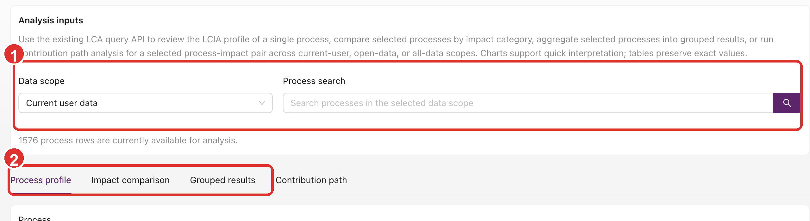

# Process Analysis Workspace

TianGong LCA now includes a dedicated **Process Analysis Workspace** for advanced LCIA-oriented
analysis across multiple processes.

It is different from ordinary [LCIA Calculation & Results](./lcia):

- The `LCIA` page is for reading results from one process or one model
- This workspace is for comparison, grouping, and contribution-path exploration across processes

## How to enter

The current entry point is:

1. Open **My Data → Processes**
2. Click **LCA Analysis** in the process-list toolbar

This is an advanced workspace entry and may not appear directly in the left navigation menu.

## Shared inputs

At the top of the page, all tabs share the same analysis inputs:

- **Data scope**
- **Process search**

### Data scope

The current options are:

- **Current user data**
- **Open data**
- **All data**

Choose them according to your goal:

- Use **Current user data** when checking your own drafts
- Use **Open data** when comparing published datasets
- Use **All data** when you need the broadest available candidate set

### Process search

Process search narrows the list of available candidates for all tabs below.

In the screenshot, `1` marks the shared input area used by every analysis tab, and `2` marks the
four analysis tabs. Set the scope and candidate processes first, then switch into the specific
analysis mode you need.

## How Process Modelling Fields Affect Analysis

Process analysis depends on process-network snapshots built by the backend solver. For product input
exchanges, the solver first determines a supply region, then searches for available providers in that
region.

Pay special attention to these modelling fields:

- Exchange **Location** can act as an explicit supply region, such as `CN`, `CN-BJ`, `RER`, or
  `GLO`.
- If the exchange has no usable Location, the system uses the consumer process
  `locationOfOperationSupplyOrProduction` as the default supply region.
- When multiple providers can supply the same reference flow, the system uses each provider
  process's annual supply or production volume as a relative weight within the selected region.
- Annual supply or production volume only affects the split between providers. It does not increase
  or reduce the technical demand of the exchange itself.

If contribution paths or grouped results differ from what you expected, first check the related
exchange Location, process geography, and annual supply or production volume fields.

## Tab 1: Process profile

**Process profile** is for inspecting the LCIA profile of one process.

### Profile steps

1. Select one process
2. Click **Load profile**

### Profile result content

The result area typically includes:

- Query metadata such as `snapshot_id`, `result_id`, source, and computed time
- A summary of the selected process
- A **Non-zero categories** count
- A **Normalized profile chart**
- A detailed impact-category table

Use this when you need a quick view of the relative impact pattern of a single process.

## Tab 2: Impact compare

**Impact compare** compares multiple processes under one impact category.

### Compare steps

1. Select one **Impact category**
2. Choose multiple processes in the selection table
3. Click **Run analysis**

Use **Clear selection** if you want to reset the comparison set.

### Compare result content

The tab typically returns:

- Number of compared processes
- Top contributor
- Absolute total
- A comparison chart
- A detailed comparison table

Use it when you want to know which candidate process contributes more under the same impact
category.

## Tab 3: Grouped results

**Grouped results** aggregates multiple processes by a selected dimension before comparison.

### Available grouping dimensions

The current UI supports:

- **Location**
- **Classification**
- **Type of data set**
- **Team**

### Grouped-analysis steps

1. Select one **Impact category**
2. Select one **Group by** rule
3. Choose multiple processes
4. Click **Run grouped analysis**

### Grouped-analysis result content

The result area usually includes:

- Number of groups
- Number of selected processes
- Top group
- Absolute total
- A **Grouped ranking chart**
- A grouped detail table

Use this tab when the real question is “which category or cluster contributes the most overall?”

## Tab 4: Contribution path

**Contribution path** starts from one root process and explores how impact travels through the
process network.

### Inputs

Besides the impact category and root process, the page lets you adjust:

- **Amount**
- **Max depth**
- **Top-k children**
- **Cutoff share**
- **Max nodes**

### Contribution-path steps

1. Select one **Impact category**
2. Choose one **root process**
3. Adjust the numeric parameters if needed
4. Click **Run contribution path**

### Contribution-path result content

The result area typically includes:

- Total impact
- Coverage
- Expanded nodes
- Truncated nodes
- Echoed root-process and parameter settings
- A direct-contributor chart
- A **Contribution path Sankey**
- Additional branch, node, or link tables below

Use this tab when you need to understand which upstream paths dominate the impact.

## Relation to Task Center

Some analyses can trigger background solving work. If processing takes longer, keep an eye on the
shared [TIDAS ZIP Import, Export, and Task Center](./tidas-zip-workflows) guidance.

## When not to use this workspace

You usually do not need this workspace when:

- You only need LCIA results for one process or one model
- You only need standard JSON export
- You only need review or permission management

Those cases fit better with:

- [LCIA Calculation & Results](./lcia)
- [Data Review](./data-review)
- [Permissions & Data Spaces](./permissions-and-data-scopes)
